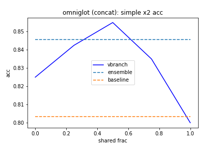

# Virtual Branching

Main idea: Partially share parameters between multiple models (“branches”) in order to reduce overall parameter footprint while maintaining feature diversity (increased feature diversity generally leads to improved ensemble performance). We also incorporate bagging to further improve performance.

Datasets:
- MNIST
- Toy classification dataset (generated using SciPy)
- CIFAR10
- Omniglot (triplet loss)
- Market 1501 (person re-identification) (triplet loss)

The vbranch implementation is modeled after Keras. Currently supported layers include Dense, Batch Normalization, Conv2D, padding layers, and pooling layers. We provide implementations of ResNet and DenseNet.

ArXiv pre-print: "Virtual CNN Branching: Efficient Feature Ensemble for Person Re-Identification"
https://arxiv.org/pdf/1803.05872.pdf

## Results

### MNIST

FCN = 784 (input) -> 512 -> 10 (output); batch norm, relu; softmax; 20 epochs;
learning rate = 0.001; test = before mean acc

Training graph:

CNN = 1 (input) -> 16 -> 16 -> 32 -> 32 filters; batch norm, relu; softmax; 30 epochs;
learning rate = 0.001; test = before mean acc

Converges by around epoch 30

Correlation and Strength (from Random Forest paper):

### Omniglot

CNN = 1 (input) -> 32 -> 32 -> 64 -> 64 -> 128 -> 128 -> 256 -> 256 filters; batch norm, relu; softmax; 90 epochs;
learning rate = 0.001; concatenate embeddings

### Toy

[toy-classification-results](toy-classification.ipynb)

## Notes

Can we reduce batch size of individual branches when using vbranch and achieve same performance improvements with lower computation?

How to decrease correlation between virtual branches?

What is effect of varying shared_frac throughout the model (e.g., could lower level of sharing for lower layers help propagate variance to final layers)?

Person re-ID: ignore samples that cannot be detected properly by OpenPose

### Related Papers

http://openaccess.thecvf.com/content_cvpr_2018/papers/Rebuffi_Efficient_Parametrization_of_CVPR_2018_paper.pdf

https://arxiv.org/pdf/1511.02954.pdf

http://leemon.com/papers/2009scsb.pdf

Net2Net:
https://arxiv.org/pdf/1511.05641.pdf

TF QueueRunners:
https://adventuresinmachinelearning.com/introduction-tensorflow-queuing/

https://blog.metaflow.fr/tensorflow-how-to-optimise-your-input-pipeline-with-queues-and-multi-threading-e7c3874157e0

TF Dataset API:
https://towardsdatascience.com/how-to-use-dataset-in-tensorflow-c758ef9e4428

Bagging (with derivations):
https://www.stat.berkeley.edu/~breiman/bagging.pdf

Random Forest:
https://www.stat.berkeley.edu/~breiman/randomforest2001.pdf
