# Virtual Branching

- Simple ensemble
- Multiple branches (same data)
- Multiple branches (different data, equally sized partitions)
- Multiple branches (different data, differently sized partitions)

Datasets:
- MNIST
- Toy classification dataset
- Omniglot
- Person Re-ID (future)

## Results

### MNIST

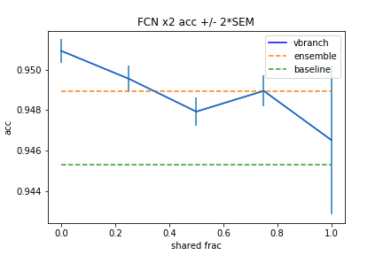
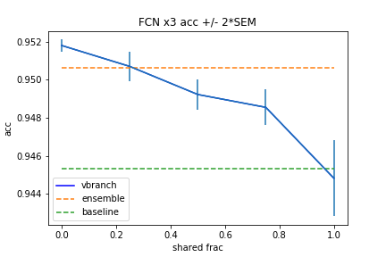
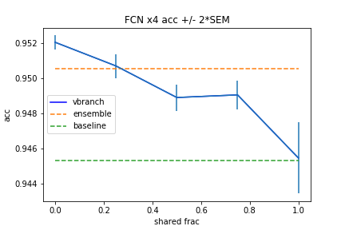

FCN = 784 (input) -> 512 -> 10 (output); batch norm, relu; softmax; 15 epochs;
learning rate = 0.001; test = before mean acc

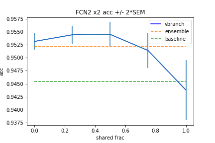
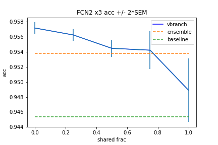
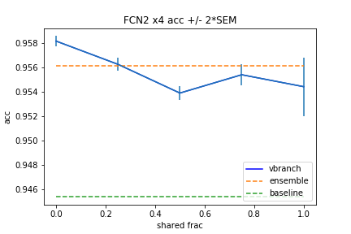

FCN = 784 (input) -> 512 -> 256 -> 10 (output); batch norm, relu; softmax; 15 epochs;
learning rate = 0.001; test = before mean acc

** No batch norm or relu for final FC layer (output layer); improves performance for shared_frac=1; for figures with batch norm/relu after final FC layer, see [old-fcn](old/04272019/figs)

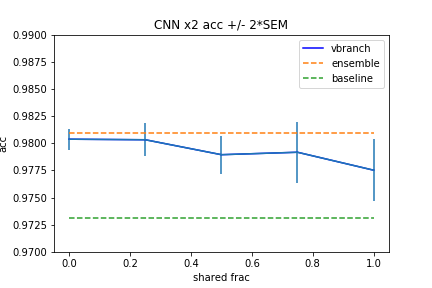

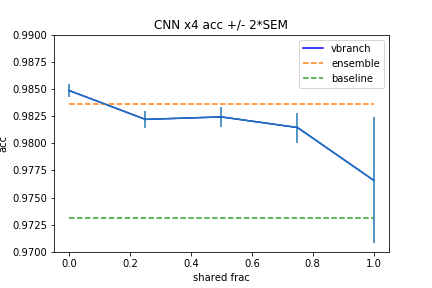

CNN = 1 (input) -> 16 -> 16 -> 32 -> 32 filters; batch norm, relu; softmax; 30 epochs;
learning rate = 0.001; test = before mean acc

Training graph:
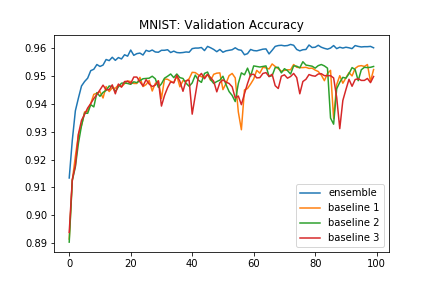

CNN = 1 (input) -> 16 -> 16 -> 32 -> 32 filters; batch norm, relu; softmax; 30 epochs;
learning rate = 0.001; test = before mean acc

Converges by around epoch 30

Correlation and Strength (from Random Forest paper):

### Omniglot

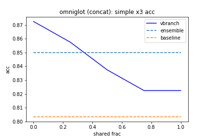
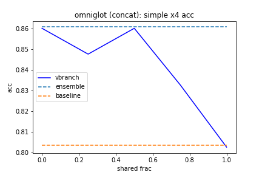

CNN = 1 (input) -> 32 -> 32 -> 64 -> 64 -> 128 -> 128 -> 256 -> 256 filters; batch norm, relu; softmax; 90 epochs;
learning rate = 0.001; concatenate embeddings

### Toy

[toy-classification-results](toy-classification.ipynb)

## Notes

Can we reduce batch size of individual branches when using vbranch and achieve same performance improvements with lower computation?

How to decrease correlation between virtual branches?

What is effect of varying shared_frac throughout the model (e.g., could lower level of sharing for lower layers help propagate variance to final layers)?

Person re-ID: ignore samples that cannot be detected properly by OpenPose

### Related Papers
ArXiv pre-print: "Virtual CNN Branching: Efficient Feature Ensemble for Person Re-Identification"
https://arxiv.org/pdf/1803.05872.pdf

http://openaccess.thecvf.com/content_cvpr_2018/papers/Rebuffi_Efficient_Parametrization_of_CVPR_2018_paper.pdf

https://arxiv.org/pdf/1511.02954.pdf

http://leemon.com/papers/2009scsb.pdf

Net2Net:
https://arxiv.org/pdf/1511.05641.pdf

TF QueueRunners:
https://adventuresinmachinelearning.com/introduction-tensorflow-queuing/

https://blog.metaflow.fr/tensorflow-how-to-optimise-your-input-pipeline-with-queues-and-multi-threading-e7c3874157e0

TF Dataset API:
https://towardsdatascience.com/how-to-use-dataset-in-tensorflow-c758ef9e4428

Bagging (with derivations):
https://www.stat.berkeley.edu/~breiman/bagging.pdf

Random Forest:
https://www.stat.berkeley.edu/~breiman/randomforest2001.pdf
