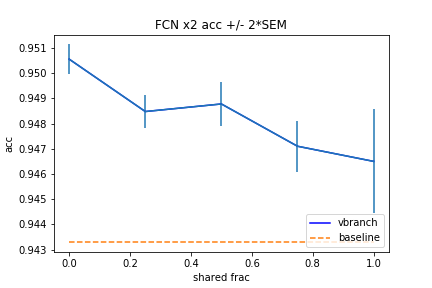
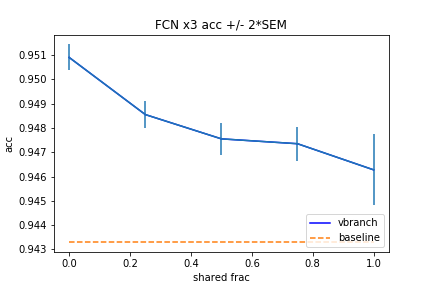
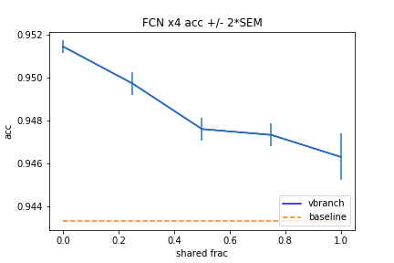
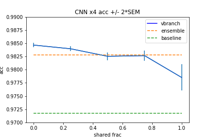

# Virtual Branching

- Random Forest (simple ensemble)
- Multiple branches (same data)
- Multiple branches (different data, equally sized partitions)
- Multiple branches (different data, differently sized partitions)

Datasets:
- MNIST
- Omnigloat
- Person Re-ID (future)

## Results

FCN = 784 units, 128 units, 10 units; batch norm, relu; softmax; 30 epochs;
learning rate = 0.001; test = before mean acc

CNN = 1 -> 16 -> 16 -> 32 -> 32 filters; batch norm, relu; softmax; 30 epochs;
learning rate = 0.001; test = before mean acc

## Related Papers
http://openaccess.thecvf.com/content_cvpr_2018/papers/Rebuffi_Efficient_Parametrization_of_CVPR_2018_paper.pdf

https://arxiv.org/pdf/1511.02954.pdf

http://leemon.com/papers/2009scsb.pdf

Net2Net:
https://arxiv.org/pdf/1511.05641.pdf

TF QueueRunners:
https://adventuresinmachinelearning.com/introduction-tensorflow-queuing/

https://blog.metaflow.fr/tensorflow-how-to-optimise-your-input-pipeline-with-queues-and-multi-threading-e7c3874157e0

TF Dataset API:
https://towardsdatascience.com/how-to-use-dataset-in-tensorflow-c758ef9e4428
